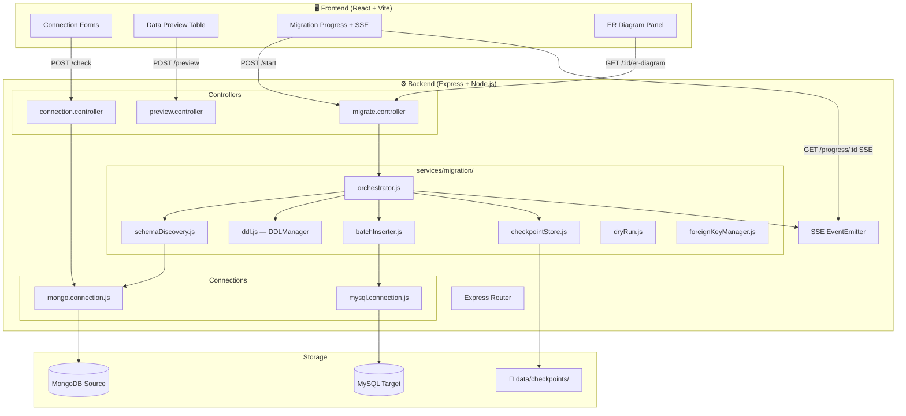
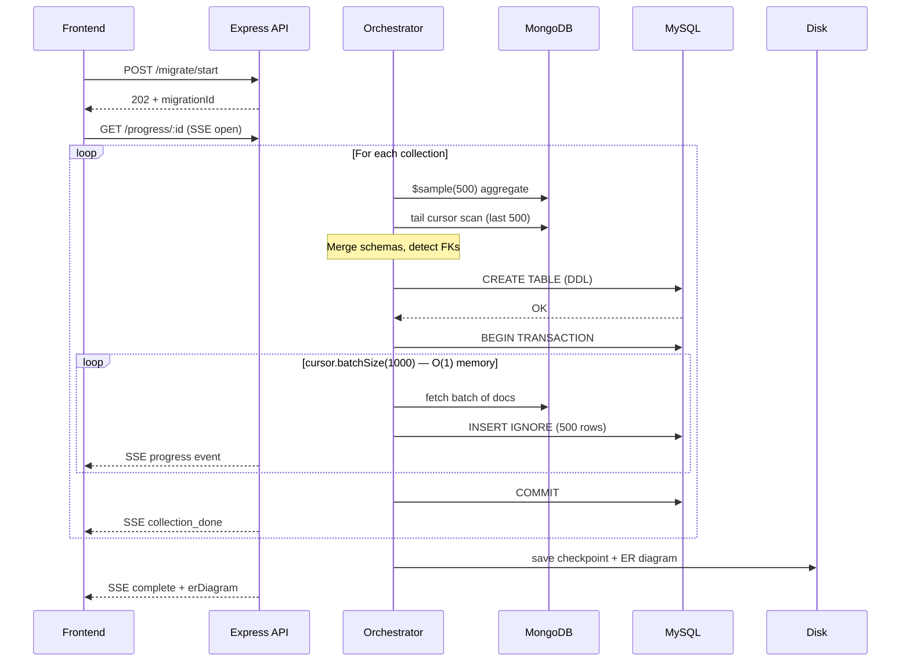
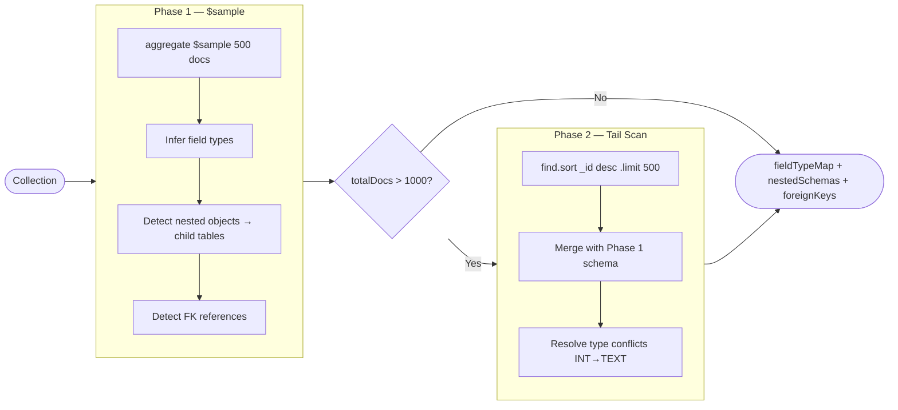

# 🗄️ MongoDB → MySQL Migration Tool

<div align="center">


**A production-grade, full-stack tool to migrate MongoDB collections to MySQL with zero data loss, real-time progress streaming, and automatic schema inference.**

[Live Demo](https://data-migration-tool-ivory.vercel.app) · [Report a Bug](https://github.com/dixitshubham93/data_migration_tool/issues) · [Request Feature](https://github.com/dixitshubham93/data_migration_tool/issues)

</div>

---

## ✨ Features

| Feature | Description |
|---|---|
| 🔌 **Visual Connection Manager** | Connect to MongoDB (local/Atlas) and MySQL with real-time ping |
| 🔍 **Smart Schema Discovery** | Hybrid `$sample` + tail cursor scan — no `.toArray()`, O(1) memory |
| 📊 **Data Preview** | Paginated table view of every collection before migrating |
| ⚡ **Batch Insertion** | 500 rows per `INSERT` — ~500× fewer MySQL round trips |
| 🔄 **Real-time SSE Progress** | Live per-collection progress bars via Server-Sent Events |
| 🏛️ **ER Diagram** | Auto-generated entity–relationship diagram after migration |
| 🔁 **Resume Capability** | File-persisted checkpoints — resume from exactly where it stopped |
| 🔀 **Transaction Safety** | Per-collection `BEGIN/COMMIT/ROLLBACK` — failed collection reverts cleanly |
| 🔗 **FK Detection & Apply** | Heuristic foreign key detection with user-confirmed application |
| 🧪 **Dry-Run Mode** | Preview schema and DDL without touching MySQL |
| 📜 **Migration History** | Disk-persisted log of all past migrations |
| 🛡️ **Input Validation** | Per-route middleware rejects bad requests before any DB call |

---

## 🏗️ Architecture

### System Overview



### Migration Data Flow



### Schema Discovery Strategy



---

## 🗂️ Project Structure

```
migration_tool/
├── backend/
│   └── src/
│       ├── connections/
│       │   ├── mongo.connection.js     # URI builder + MongoClient factory
│       │   └── mysql.connection.js     # mysql2 pool + ping utility
│       ├── controllers/
│       │   ├── connection.controller.js # check, listDatabases, listCollections
│       │   ├── migrate.controller.js    # start, resume, dryRun, history, SSE, ER, FK
│       │   └── preview.controller.js   # paginated collection preview
│       ├── middlewares/
│       │   ├── error.middleware.js      # global error handler
│       │   └── validate.middleware.js   # per-route input validation
│       ├── services/
│       │   ├── migration/
│       │   │   ├── orchestrator.js      # top-level coordinator
│       │   │   ├── schemaDiscovery.js   # hybrid $sample + tail cursor
│       │   │   ├── ddl.js              # DDLManager: CREATE/ALTER TABLE
│       │   │   ├── batchInserter.js    # 500-row INSERT batching
│       │   │   ├── typeMapper.js       # SQL type inference + conflict resolution
│       │   │   ├── flattener.js        # nested → flat, FK heuristics
│       │   │   ├── checkpointStore.js  # file-persisted resume state
│       │   │   ├── dryRun.js           # schema preview, no MySQL writes
│       │   │   └── foreignKeyManager.js # detect + apply FK constraints
│       │   └── preview/
│       │       └── previewService.js   # paginated MongoDB preview
│       ├── routes/
│       │   └── migrateRouter.js
│       └── App.js
├── frontend/
│   └── src/
│       ├── components/
│       │   ├── DatabaseConnectionForm.tsx  # credential inputs + DB/collection picker
│       │   ├── DataPreview.tsx             # sortable table component
│       │   ├── getData.tsx                 # preview data fetcher
│       │   ├── MigrationProgress.tsx       # SSE stream + ER diagram panel
│       │   └── ConfigurationSummary.tsx
│       ├── types/
│       │   └── database.ts
│       └── App.tsx
├── tests/
│   └── smoke.spec.ts                   # Playwright end-to-end smoke tests
├── data/
│   └── checkpoints/                    # per-migration JSON state files
├── playwright.config.js
└── README.md
```

---

## 🚀 Getting Started

### Prerequisites

| Tool | Version |
|---|---|
| Node.js | 18+ |
| MongoDB | 6+ (or Atlas) |
| MySQL | 8+ |
| npm | 9+ |

### 1. Clone & Install

```bash
git clone https://github.com/Harshi-max/Data_migration.git
cd Data_migration

# Backend
cd backend && npm install

# Frontend
cd ../frontend && npm install
```

### 2. Configure Environment

Create `backend/.env`:

```env
FRONTEND_URL=http://localhost:5173
PORT=3000
```

### 3. Start Development Servers

```bash
# Terminal 1 — Backend
cd backend
npm run server        # nodemon, auto-restart on changes

# Terminal 2 — Frontend
cd frontend
npm run dev           # Vite dev server at http://localhost:5173
```

---

## 📡 API Reference

### Connection

| Method | Endpoint | Description |
|---|---|---|
| `POST` | `/migrate/check` | Ping source or target DB |
| `POST` | `/migrate/databases` | List MongoDB databases |
| `POST` | `/migrate/collections` | List collections in a DB |

### Migration

| Method | Endpoint | Description |
|---|---|---|
| `POST` | `/migrate/start` | Start migration → 202 + `migrationId` |
| `POST` | `/migrate/resume/:id` | Resume failed/partial migration |
| `POST` | `/migrate/dry-run` | Schema preview, no MySQL writes |
| `GET` | `/migrate/status/:id` | Polling status (checkpoint state) |
| `GET` | `/migrate/progress/:id` | **SSE** — real-time per-collection events |
| `GET` | `/migrate/history` | All past migrations (disk-persisted) |

### Post-Migration

| Method | Endpoint | Description |
|---|---|---|
| `GET` | `/migrate/:id/er-diagram` | Stored ER diagram as JSON |
| `GET` | `/migrate/:id/foreign-keys` | Detected FK relationships |
| `POST` | `/migrate/:id/apply-fk` | Apply confirmed FK constraints |

### Preview

| Method | Endpoint | Description |
|---|---|---|
| `POST` | `/migrate/preview` | Paginated collection data preview |

---

## 🧪 Testing

Tests run against the live Vercel deployment in CI, and against `localhost:5173` locally.

```bash
# Install Playwright browsers (first time only)
npx playwright install --with-deps

# Run all tests
npx playwright test

# Interactive UI mode
npx playwright test --ui

# Specific browser
npx playwright test --project=chromium
```

CI runs on every push to `main`, `master`, and `work` branches via GitHub Actions.

---

## ⚙️ Configuration Options

Pass `options` inside the migration request body to tune behaviour:

```json
{
  "data": {
    "source": { ... },
    "target": { ... },
    "options": {
      "scanMode": "hybrid",       // "sample" | "hybrid" | "full_scan"
      "stopOnError": false,       // abort all remaining collections on first failure
      "sampleSize": 500,          // docs to $sample in schema discovery
      "tailSize": 500             // docs for tail scan phase
    }
  }
}
```

| `scanMode` | Accuracy | Speed | Use when |
|---|---|---|---|
| `sample` | Good | Fastest | Dev / small collections |
| `hybrid` | Better | Fast | **Default — recommended** |
| `full_scan` | Perfect | Slow | Critical accuracy required |

---

## 🔁 Resume a Failed Migration

If a migration fails mid-way (network drop, MySQL timeout, etc.):

1. The checkpoint is saved to `data/checkpoints/<migrationId>.json` automatically
2. Already-completed collections are preserved
3. Call `POST /migrate/resume/:migrationId` with the same source/target config
4. The orchestrator skips completed collections and continues from where it stopped

---

## 🏛️ ER Diagram

After a successful migration, the ER diagram is:
- Returned in the `complete` SSE event
- Stored in the checkpoint file
- Available via `GET /migrate/:id/er-diagram`
- Rendered in the frontend as expandable table cards with column types, PK/FK badges, and relationship arrows

---


